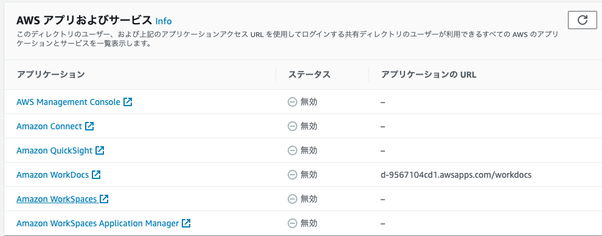

# グラフ分析ハンズオン
このハンズオンでは、ダミーの保険契約データを元にネットワークグラフを生成してAmazon Neptuneに投入し、Webアプリケーションから照会する演習を行います。

## 1. 環境構築
### 1-1. ハンズオンで利用するアカウント
* AWSプロフェッショナルサービスにて用意した以下のアカウントをご利用下さい。

|no.|Name|アカウントID|IAMユーザ|
|---:|:---|:---|:---|
|1||||
|2||||
|3||||
|4||||
|5||||
|6||||

* パスワードは当日お知らせします。
* ハンズオンでは **東京リージョン** をご利用ください。

[AWSコンソール](https://console.aws.amazon.com/console/home)  

### 1-2. VPC環境を作成する
後続のステップで作成するAWSサービスが利用するVPCやサブネット、S3バケットを作成します。

* 以下の手順でCloudFormationスタックを作成します。
  * 「サービス」 → 「CloudFormation」 → 「スタック」→  「スタックの作成」ボタン→
     * 「前提条件 - テンプレートの準備」チェックボックス「テンプレートの準備完了」をチェック
     * 「テンプレートの指定」チェックボックス「Amazon S3 URL」をチェック
     *  https://s3-ap-northeast-1.amazonaws.com/tuki4-base-bucket/cfn/ds-workshop/vpc.yml を指定  
 *  「次へ」ボタン →以下を指定
```
スタックの名前    : vpcPoC　
Environment Type : Dev
Project Name     : myproject
```
  * 「次へ」ボタン →　オブション入力画面はデフォルトのまま「次へ」ボタン→
  * 確認画面　→　「作成」ボタン
* ステータスが "CREATE_COMPLETE"　になるまで待ちます。
* 以下のVPCおよび関連リソースが構築されます。
```
myvpc
```

### 1-3. CloudFormationを利用してAmazon Neptune、Webサーバを作成する

グラフデータベースであるAmazon Neptune、グラフを可視化するためのWebサーバを作成します。

* 以下の手順でCloudFormationスタックを作成します。
  * 「サービス」 → 「CloudFormation」 → 「スタック」→  「スタックの作成」ボタン→
     * 「前提条件 - テンプレートの準備」チェックボックス「テンプレートの準備完了」をチェック
     * 「テンプレートの指定」チェックボックス「Amazon S3 URL」をチェック
     *  https://s3-ap-northeast-1.amazonaws.com/tuki4-base-bucket/cfn/ds_workshop/neptune.yml を指定  
 *  「次へ」ボタン →以下を指定
```
スタックの名前    : neptune　
Environment Type : Dev
Project Name     : myproject
Commonpassword :
KeyPairName: neptune-web
```
  * 「次へ」ボタン →　オブション入力画面はデフォルトのまま「次へ」ボタン→
  * 確認画面　→　「作成」ボタン
* ステータスが "CREATE_COMPLETE"　になるまで待ちます。


### 1-4. SageMaker Notebookを作成する
機械学習環境およびグラフデータの作成環境として利用するAmazon SageMakerを作成します。

* 以下の手順でCloudFormationスタックを作成します。
  * 「サービス」 → 「CloudFormation」 → 「スタック」→  「スタックの作成」ボタン→
     * 「前提条件 - テンプレートの準備」チェックボックス「テンプレートの準備完了」をチェック
     * 「テンプレートの指定」チェックボックス「Amazon S3 URL」をチェック
     *  https://s3-ap-northeast-1.amazonaws.com/tuki4-base-bucket/cfn/ds_workshop/sagemaker.yml を指定  
 *  「次へ」ボタン →以下を指定
```
スタックの名前    : sagemaker　
Environment Type : Dev
Project Name     : myproject
```
  * 「次へ」ボタン →　オブション入力画面はデフォルトのまま「次へ」ボタン→
  * 確認画面　→　「作成」ボタン
* ステータスが "CREATE_COMPLETE"　になるまで待ちます。

### 1-5. WorkSpacesでデスクトップを作成する
* 「サービス」メニューからDirectory Serviceへ移動します。
* ディレクトリ名「poc.example.com」のディレクトリIDを選択します。
* アプリケーション管理の「AWSアプリおよびサービス」から「Amazon WorkSpaces」を選択します。

* ディレクトリ名「poc.example.com」のディレクトリを選択し、「アクション」から「登録」を選択します。
* ポップアップする画面ではそのまま「登録」をクリックします。
* ディレクトリの「登録済み」列が「はい」になったら、左側のペインから「WorkSpaces」に進みます。
* 「WorkSpacesの起動」を選択します。
* 「ディレクトリの選択」画面でディレクトリ「poc.example.com」が選択されていることを確認して、「次のステップ」を選択します。
* 「ユーザーの特定」画面の「新規ユーザーを作成してディレクトリに追加します」にパラメータを入力します。
```
ユーザー名：　dsuser
名 ： 任意
姓 ： 任意
Eメール ： 受信できるメールアドレス
```
* パラメータの入力が終わったことを確認して「ユーザーの作成」を選択します。
* 画面下部にユーザーが追加されるので、「次のステップ」を選択します。
* 「バンドルの選択」画面では、「Performance with Windows 10」を選択し、言語には「日本語」を選択し、画面下部の「次のステップ」を選択します。
* 次の「WorkSpacesの設定」では何も変更せずに「次のステップ」を選び、次に「WorkSpacesの起動」を選択します。

WorkSpacesの起動が終わったら、登録したメールアドレスに通知が送信されます。起動までは最大20分かかるので、つぎのハンズオンステップに進みます。


## 2. グラフデータ作成
このステップでは、構造化データからグラフデータを作成します。

### 2-1. マネジメントコンソールからSageMaker Notebookを開く
* 「サービス」メニューからAmazon SageMakerを選択し、左側のペインから「ノートブックインスタンス」を選択します。
* 「ds-workshop-graph-ml」というノートブックインスタンスが作成されているので、「Jupyterを開く」を選択します。
* ブラウザの別タブでJupyterの画面が開くので、「step2_extract_node_and_edge」を選択します。

### 2-2. 構造化データからグラフデータを生成する
* Notebookの流れに従ってグラフデータを生成します
* 「マネジメントコンソールからNeptuneにS3アクセスするIAMロールを付与する」セクションでは、マネジメントコンソールの画面に戻り、「サービス」メニューからAmazon Neptuneを選択してください。
* 左側のペインから「クラスター」を選択し、存在しているクラスターを選択します。
* つぎに、「クラスターアクション」から「IAMロールの管理」を選択してください。
* 「クラスターにIAMロールを追加」から「neptune-NeptuneLoadRole-xxxx」を選択して「ロールの追加」をクリックします。
* 「完了」クリックして設定を終了します。

この操作で、NeptuneインスタンスがS3にアクセスする権限を追加したので、Notebookの画面に戻ってデータロードを行います。

## 3. Graphexpを利用してグラフデータを可視化する
Notebookでグラフデータを生成し、Neptuneに投入できたので、そのデータをブラウザから参照します。

### 3-1. WorkSpacesのデスクトップにログインする
* Amazon WorkSpacesからの通知メールが登録したメールアドレスに届いていることを確認します。
* 「1. ユーザーのプロファイルを入力し、次のリンクから WorkSpaces クライアントをダウンロードします。」に続くリンクをクリックし、パスワードを設定します。
* ハンズオンで利用している端末から [WorkSpaces クライアントのダウンロード](https://clients.amazonworkspaces.com/) を開き、端末に応じたクライアントをダウンロードします。
* ダウンロードしたWorkSpacesクライアントをインストールします
* WorkSpacesクライアントが起動されたら、メールで受信した「登録コード」を入力します。
* ユーザー名：dsuser, パスワード：先ほど指定したパスワード でWorkSpaces画面にログインします。

### 3-2. ブラウザを起動してGraphexpを開く
* Firefoxを起動し、アドレス欄にCloudFormationのNeptuneスタック 出力タブから取得した「WebServerDnsName」の値を入力します。
* CloudFormationで構成したWebサーバの画面が起動します。
* 「Server Settings」にNeptuneのEndpointを設定し、Closeを選択します。


### 3-3. グラフデータを取得し、インタラクティブに探索する

## 4. 新たなグラフデータを追加する